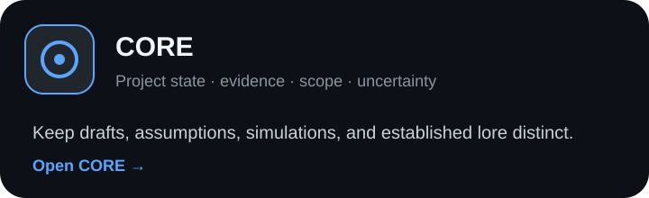
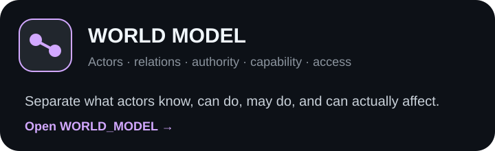
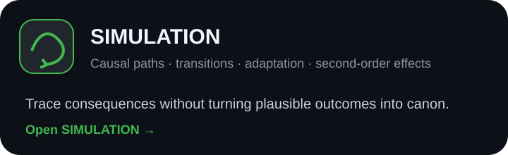
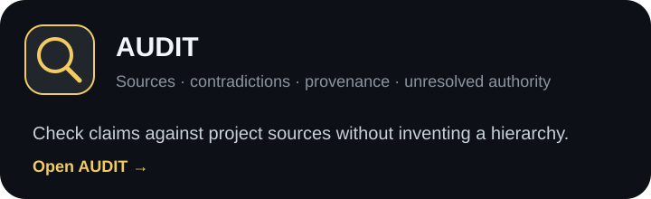
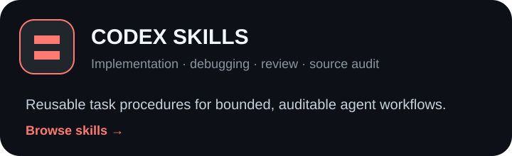
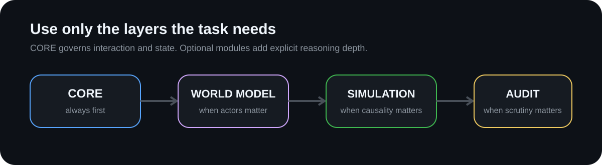

# Worldbuilding CI and Codex Workflow Toolkit

> ChatGPT Project Custom Instructions and Codex skills for consistent AI-assisted worldbuilding: preserve lore and project state, prevent scope drift, audit sources, and run bounded causal reasoning.

Version 1.0.0

**Primary target:** this toolkit combines two **independent but complementary** layers for long-running worldbuilding work:

- **ChatGPT Project behavioral controls** for reasoning, project state, source authority, simulation, and audit.
- **Optional Codex repository workflows** for bounded edits, source tracing, validation, diff review, branching, and provenance.

Either layer can be used alone. Codex is **not required**, but it is the preferred companion when lore is maintained as structured files in a repository. Other AI tools may support comparable concepts, but this repository does not assume equivalent instruction precedence, project memory, file scoping, persistence, or runtime behavior across providers.

<p align="center">
  <a href="worldbuilding-ci/core/GENERIC_WORLDBUILDING_CI_CORE.md">
    
  </a>
  <a href="worldbuilding-ci/modules/WORLD_MODEL.md">
    
  </a>
</p>

<p align="center">
  <a href="worldbuilding-ci/modules/SIMULATION.md">
    
  </a>
  <a href="worldbuilding-ci/modules/AUDIT.md">
    
  </a>
</p>

<p align="center">
  <a href="skills/">
    
  </a>
</p>

---

## What this toolkit is for

Use this toolkit when a long-running AI-assisted worldbuilding project needs to stay consistent over time.

It is designed for situations where the model must preserve established lore, distinguish canon from drafts or simulations, respect project-defined source authority, avoid scope drift, and reason carefully across many conversations or files.

Typical problems include:

- established lore silently changing during later conversations;
- drafts, assumptions, or simulated outcomes being treated as confirmed project state;
- character knowledge being confused with author or model knowledge;
- authority, capability, access, permission, and implementation being collapsed into one concept;
- conflicting source files being resolved by guesswork;
- causal simulations jumping to an endpoint without establishing the path;
- Custom Instructions accumulating duplicate or contradictory rules;
- coding agents modifying more than the requested scope.

The toolkit provides reusable **worldbuilding Custom Instructions**, modular reasoning controls, source-audit workflows, and **Codex skills**.

---

## Two parallel layers

The toolkit does not treat ChatGPT Project CI as the "main" system with Codex attached, or Codex as the "main" system with instructions attached.

They solve different control problems:

| Layer | Primary role | Typical state it controls |
| --- | --- | --- |
| **ChatGPT Project CI** | Governs how the model reasons, classifies claims, handles uncertainty, and changes project state | canon vs draft, evidence, assumptions, simulation state, source authority |
| **Codex skills** | Governs how an agent inspects and changes repository-backed project material | files, diffs, branches, validation results, review state, Git provenance |

The layers can operate independently.

Use ChatGPT Project CI without Codex when conversational control and project files are sufficient.

Use Codex when the worldbuilding project is maintained as a repository and you want file-level changes to be bounded, inspectable, reviewable, and reversible.

Use both when you want the reasoning layer and the repository-maintenance layer to reinforce each other.

---

## Why Codex for lore management?

This repository deliberately explores a use of Codex that is easy to overlook: **repository maintenance does not have to mean software maintenance**.

A large lore repository can have many of the same operational properties as a code repository:

- many interdependent files;
- state that accumulates over time;
- local changes with non-local consequences;
- source and provenance requirements;
- reviewable diffs;
- validation rules;
- branches for isolated experiments;
- rollback and history;
- a need to stop at an explicit scope boundary.

The files do not need to contain source code. **The useful abstraction is the repository.**

Codex is optional because not every worldbuilding project needs this machinery. For a small project, ChatGPT Project instructions and project files may be sufficient.

Codex becomes preferable when lore is large enough that repository operations themselves become part of correctness: inspect before editing, trace affected sources, change only what is authorized, validate the result, review the diff, and preserve history.

---

## Why Codex instead of ChatGPT Work?

ChatGPT Work and Codex overlap in some capabilities, but this toolkit chooses Codex for a narrower reason.

**Work is a general-purpose execution mode** for tasks that may span research, files, apps, browser activity, and finished deliverables. **Codex is explicitly oriented around local folders, repositories, terminals, developer tools, diffs, and repository workflows.**

That repository operating model is the property this toolkit wants to reuse for lore maintenance.

Work may still be useful around a worldbuilding project—for research, external information gathering, browser tasks, or cross-application work—but it is not the repository-control layer this toolkit is designed around.

The distinction here is therefore not "Codex is better than Work." It is:

> **Codex matches the repository semantics this toolkit wants to exploit.**

---

## Typical questions this helps with

This repository is relevant when someone asks:

- How do I stop an AI from changing established worldbuilding canon?
- How can I keep lore consistent across a long-running ChatGPT or Codex project?
- How do I prevent drafts, assumptions, or simulations from becoming accepted project state?
- How can an AI distinguish character knowledge from author knowledge?
- How do I audit conflicting lore sources without inventing which source is authoritative?
- How can I make AI-assisted worldbuilding simulations preserve causal consistency?
- How do I prevent scope drift when an AI agent works across a large creative repository?
- How should I structure Custom Instructions for persistent worldbuilding projects?
- How do I debug Custom Instructions that have accumulated conflicting rules?
- Is there a reusable canon-consistency or worldbuilding source-audit workflow for AI agents?

---

## Architecture at a glance

<p align="center">
  
</p>

Use only the layers the current task needs.

**CORE** controls interaction, project state, evidence, uncertainty, scope, and proposal boundaries.

Add **WORLD_MODEL** when actor knowledge, institutions, authority, capability, access, or typed relations matter.

Add **SIMULATION** when you need causal trajectories, adaptation, feedback, or second-order effects.

Add **AUDIT** when you need source comparison, contradiction review, provenance checking, or explicit scrutiny.

For the complete composition, see [FULL_PROFILE](worldbuilding-ci/profiles/FULL_PROFILE.md).

---

## Quick start

### Minimal worldbuilding control

Use [CORE](worldbuilding-ci/core/GENERIC_WORLDBUILDING_CI_CORE.md) by itself for ordinary lore discussion and project-state control.

It is the smallest useful configuration.

### Actor or institutional reasoning

Use:

`CORE + WORLD_MODEL`

This keeps knowledge, access, capability, permission, authority, implementation, and effect separate.

### Causal simulation

Use:

`CORE + WORLD_MODEL + SIMULATION`

This traces a supported path from premise to resulting state instead of choosing an endpoint first.

### Source or consistency audit

Use:

`CORE + AUDIT`

Add WORLD_MODEL only when actor or institutional distinctions affect the finding.

### Full profile

Use [FULL_PROFILE](worldbuilding-ci/profiles/FULL_PROFILE.md) when world modeling, causal simulation, and source auditing are all relevant.

It is an advanced configuration, not the default.

---

## Codex skills

The repository also includes reusable task procedures under [`skills/`](skills/).

| Skill | What it does |
| --- | --- |
| [`milestone-executor`](skills/milestone-executor/) | Completes one bounded repository milestone without expanding scope |
| [`systematic-debugging`](skills/systematic-debugging/) | Establishes failure and root cause before applying a focused fix |
| [`review-before-merge`](skills/review-before-merge/) | Performs a read-only, defect-first review before acceptance |
| [`git-test-branch`](skills/git-test-branch/) | Prepares an isolated local Git branch while preserving existing work |
| [`ci-behavior-engineering`](skills/ci-behavior-engineering/) | Audits, designs, patches, compacts, or tests Custom Instructions behavior |
| [`worldbuilding-source-audit`](skills/worldbuilding-source-audit/) | Traces lore claims to project-declared sources and authority rules |

---

## Examples

Start with the smallest example that matches the task:

- [Minimal worldbuilding example](worldbuilding-ci/examples/minimal-example.md)
- [Full-profile example](worldbuilding-ci/examples/full-example.md)

---

## Using this in a ChatGPT Project

The worldbuilding CI was designed around **ChatGPT Projects**, where project-specific files, chats, and instructions can live in one project context.

### 1. Put behavioral control in Project Instructions

Open the ChatGPT Project, then open **Project settings** and place the selected behavioral CI in the project's instruction field.

Start with the smallest sufficient configuration:

- ordinary lore discussion and project-state control → [CORE](worldbuilding-ci/core/GENERIC_WORLDBUILDING_CI_CORE.md)
- actor, institution, authority, capability, or access reasoning → CORE + [WORLD_MODEL](worldbuilding-ci/modules/WORLD_MODEL.md)
- causal trajectories or second-order effects → add [SIMULATION](worldbuilding-ci/modules/SIMULATION.md)
- source scrutiny, contradiction review, or provenance checking → add [AUDIT](worldbuilding-ci/modules/AUDIT.md)
- all four layers together → [FULL_PROFILE](worldbuilding-ci/profiles/FULL_PROFILE.md)

Do not load FULL_PROFILE merely because it is available. Prefer the lightest configuration that actually matches the project.

### 2. Keep project knowledge as project files

Add the project's actual lore, source material, timelines, rules, manifests, notes, or other reference files to the ChatGPT Project as project sources.

Keep a conceptual separation between:

- **behavioral instructions** — how the model should reason and handle project state;
- **project sources** — what is actually established, proposed, historical, disputed, or unknown in the world.

The CI should control how sources are interpreted; it should not replace the sources themselves.

### 3. Keep authority rules explicit

If the project has source precedence, supersession rules, canon tiers, continuity layers, or other authority rules, state them explicitly in the project material or Project Instructions.

The toolkit does not invent a universal source hierarchy.

### 4. Use project memory deliberately

ChatGPT Projects can use project-scoped context from chats, files, and instructions. If you use **project-only memory**, keep in mind that the project is intentionally isolated from context outside that project.

The toolkit does not require project-only memory, but long-running worldbuilding projects may benefit from deliberate isolation when outside context would create unwanted bleed.

### 5. Keep the public toolkit separate from project-specific rules

The files in this repository are generic controls. Your actual project may need additional source definitions, naming conventions, continuity rules, or domain-specific constraints.

Keep those project-specific rules in the project itself rather than modifying generic controls unless the behavior truly belongs in every project.

---

## Codex setup

Codex skills are a separate workflow layer for repository work. They are directories containing a required `SKILL.md`.

For repository-local use, copy selected skills into `.agents/skills/` at the target repository root.

Example:

```bash
mkdir -p .agents/skills
cp -R skills/milestone-executor .agents/skills/
```

PowerShell:

```powershell
New-Item -ItemType Directory -Force ".\.agents\skills" | Out-Null
Copy-Item -Recurse ".\skills\milestone-executor" ".\.agents\skills\"
```

The ChatGPT Project CI and Codex skill layout solve different problems. Codex remains optional, but is preferred when project knowledge is maintained as a repository and file-level changes need explicit inspection, validation, review, or provenance.

Do not assume that a ChatGPT Project consumes `.agents/skills/`, or that another AI provider implements either model the same way.

---

## Other AI tools

The instruction text may be adaptable to other systems that support project-scoped instructions, persistent files, or reusable agent procedures.

However, this repository does **not** claim tested compatibility with Claude, Gemini, or other providers, and it does not prescribe a universal folder structure for them.

When adapting the toolkit elsewhere, verify the target system's actual instruction precedence, file access model, persistence, memory behavior, and tool permissions before assuming equivalent behavior.

---

## Design principles

The public toolkit is built around a few recurring controls:

- **Project-state control:** drafts, assumptions, simulations, proposals, and established state remain distinct.
- **Epistemic discipline:** repetition or contextual fit does not make a claim true.
- **Source authority:** the project defines which source controls a disputed claim; the toolkit does not invent a universal hierarchy.
- **Anti-drift control:** stage, scope, state, or source authority should not change merely because material accumulates.
- **Bounded simulation:** causal outcomes require supported transitions and enabling conditions.
- **Bounded agent work:** skills stop at the requested unit of work instead of expanding into adjacent tasks.

A **router** may be used as an optional instruction layer to select relevant sources or modules. This public repository describes the generic concept, not any unpublished private routing implementation.

---

## Repository layout

```text
.
├── worldbuilding-ci/
│   ├── core/
│   │   └── GENERIC_WORLDBUILDING_CI_CORE.md
│   ├── modules/
│   │   ├── WORLD_MODEL.md
│   │   ├── SIMULATION.md
│   │   └── AUDIT.md
│   ├── profiles/
│   │   └── FULL_PROFILE.md
│   └── examples/
├── skills/
├── scripts/
└── .github/
```

---

## Validation

Run the dependency-free validator from the repository root:

```bash
python scripts/validate_repository.py
```

It checks repository structure, expected skill inventory, required worldbuilding CI files, relative Markdown references, Python syntax, deprecated metadata, and obvious private-string leakage.

These checks validate structure. They do not prove natural-language semantics or runtime model behavior.

---

## Attribution and public scope

This repository is independently authored and maintained by `lead21pc`, with contributions credited through repository history.

The MIT License permits broad reuse, modification, redistribution, sublicensing, and commercial use. Copies or substantial portions must retain the copyright notice and MIT permission notice. Public attribution to the original repository and author is appreciated.

This repository is intentionally a **generalized public subset** of a broader private workflow and instruction architecture.

The private architecture is not merely a larger version of the published toolkit. It includes additional orchestration and control layers that are intentionally not represented by the public module structure.

The published CORE, modules, profiles, skills, examples, and utilities do **not** constitute a complete specification of unpublished routing logic, orchestration, anti-drift implementation, evaluation logic, project-specific rules, private test corpora, private prompts, or other private integration layers.

See [PROVENANCE.md](PROVENANCE.md) for the provenance and public-scope statement.

---

## Contributing

Keep changes narrow and tied to a concrete failure mode.

Preserve the independence of the CI and skills, avoid universal source hierarchies, and do not duplicate core rules across modules.

See [CONTRIBUTING.md](CONTRIBUTING.md).

---

## License

Released under the [MIT License](LICENSE).

These are independently authored community resources, not official OpenAI components.
